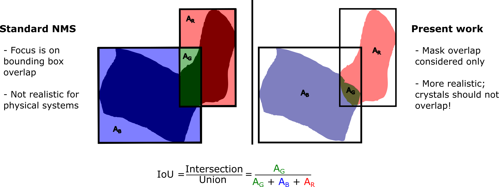

# Inference

By far the most important part of this software is the inference procedure to generate the required data for petrographic analyses. As explained in our [manuscript](https://eartharxiv.org/repository/view/5386/), we implement a tiling based approach to accommodate whole section scans that are too large to fit into computer memory. 

For simplicity, a single function will run all the required steps for inference given the configuration file for a model, model checkpoint (contains trained weights) and tile sizes, e.g.:

	__run__("thin_section_scan.jpg", "thin_section_name", config_path, checkpoint_path, "cpu", 1000,1000,250)

The above function will create tiles of the specified size and overlap from the passed image, it will perform inference over all the tiles created and it will stitch them back together. If inference was already performed, but one wants to re-stitch the images from separate tile results - perhaps using different score thresholds - then the following function can be utilized:

	__tile_only__(name, img_path,inference_result_path, path_for_saving, 1000,250, thresh = 0.8)

## Tiling & Stitching

| |
|:--:|
|<b>Overview of the slicing and tiling procedure used in PlagDetect.</b>|

Image slicing is performed based on the image size, the requested tile size and the desired overlap between tile images. At the edge of an image the overlap between tiles may be larger than requested to accommodate the section scan image size. The sliced images are saved in a new folder called "imgs", which are then used for the inference procedure one by one. The results for each inference run is saved in a new "labels" directory, which are then used to create the overall label image using our custom stitching procedure. This final image is saved in the "labels" directory also.

The stitching procedure is kept simple, but effective. We take each image one by one and combine the overlapping regions row-wise (left-to-right) identifying labels for the same phase across the two overlapping images and re-labelling for consistency as required. In case of any discrepancies across the overlapped regions, masks for crystals with the highest detection scores are prioritised to occupy the space. Each row is then stitched using the same approach top-down.

## NMS

| |
|:--:|
|<b> NMS algorithm used in PlagDetect compared to prior work </b>|

Object detection pipelines make use of a standard algorithm in post-processing to remove overlapping segmentation called [non-maximum suppression](https://ieeexplore.ieee.org/document/1699659) (NMS). The standard NMS algorithm looks at the IoU of overlapping bounding boxes to remove objects of lower detection scores above a critical IoU threshold. Further developments created [soft-NMS](https://www.google.com/url?sa=t&rct=j&q=&esrc=s&source=web&cd=&cad=rja&uact=8&ved=2ahUKEwi4sd7Ho4v_AhUpQUEAHarDDMsQFnoECAwQAQ&url=https%3A%2F%2Farxiv.org%2Fabs%2F1704.04503&usg=AOvVaw3UVSaQ0quO2ZM26F6TKZhe) that doesn't necessarily remove objects automatically, but decays detection scores based on bounding box IoU. As we care only about object masks for petrographic analyses, this is not a suitable approach for PlagDetect and we need to look at instance mask overlap as opposed to bounding boxes.

For this, we modified [matrix-NMS](https://www.google.com/url?sa=t&rct=j&q=&esrc=s&source=web&cd=&cad=rja&uact=8&ved=2ahUKEwjA2Jvzo4v_AhVxmVwKHYzGDa4QFnoECAkQAQ&url=https%3A%2F%2Farxiv.org%2Fabs%2F2003.10152&usg=AOvVaw1PlxGKtFHItAwGWKd9Hs3A) that is soft-NMS based off mask overlap to instead just remove masks based off a critical mask overlap instead as shown above. The mask with the largest detection score is always preserved. If IoU is below the critical threshold (defined by the user) then the overlapped region is given to the mask with the highest detection score, but still retaining the non-overlapped region of the lower score mask. Just like matrix-NMS this can be performed using matrix calculations only, therefore making this method more efficient as well as more suitable than the standard NMS algorithm used natively by most models. 
