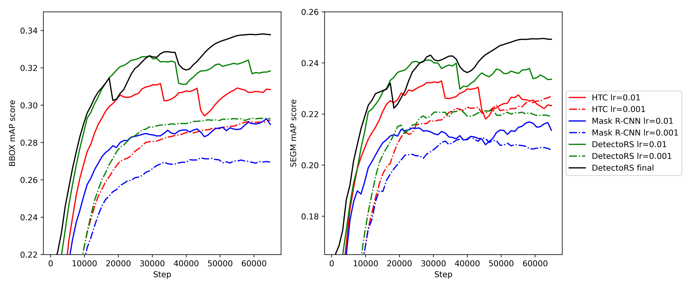

# Training Model
Models for PlagDetect were trained using the MMDetection toolbox - see their [tutorials](https://mmdetection.readthedocs.io/en/latest/user_guides/index.html) for further details.

An example notebook to be used with the free online data science resource [Kaggle](www.kaggle.com) can be found on the examples page or [here](https://www.kaggle.com/code/norberttoth/mmdetect-maskrcnn/notebook) to open in place with a reduced [dataset](https://www.kaggle.com/datasets/norberttoth/may-training-set) to train.

## Training Dataset
In order to train models on custom datasets, one must first create the ground truth data in the required format. For the current purposes using MMDetection, all training data were converted to the popular [COCO](https://cocodataset.org/#home) data format. Crystal mask segmentation can be manually performed using the python tool [Labelme](https://github.com/wkentaro/labelme). The resulting set of JSON files can be converted to COCO format using the [Labelme2coco](https://github.com/wkentaro/labelme) tool:

	labelme2coco path/to/labelme/dir --train_split_rate 0.85 

## Training procedure

To train a model on a given dataset, one must first define a model - see available models in the MMDetection [model zoo](https://github.com/open-mmlab/mmdetection/blob/main/docs/en/model_zoo.md), or create your own custom model and loss function. Next, the training procedure is to be performed using the selected optimization algorithm - most likely a variant of Stochastic Gradient Descent (SGD). The batch size, learning rate, weight decay and number of epochs all need to be defined for a given training run. Based on the evaluated performance of the trained model, the optimum training regime may be found through comparisons like shown below:

