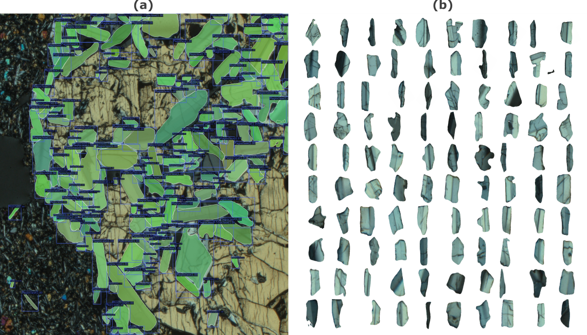

# Background

Manual object segmentation and measurements have been one of the most popular ways to generate quantitative information from microscopy data. Such procedures are cumbersome and time consuming - an inefficient use of a microscopist's time. To gain a more detailed insight into the inspiration for the current work and its present applicability, see the following [pre-print](https://eartharxiv.org/repository/view/5386/).

## Instance Segmentation

| |
|:--:|
|<b>Overview of common image segmentation methods</b>|

Instance segmentation is a type of image segmentation method that combines object detection with semantic segmentation aiming to separate both object class and instance with instance masks also generated, as shown above. This is a really powerful tool when objects are likely to be touching rendering semantic segmentation inadequate alone. When applied to Plagioclase feldspar, the model is able to pull out each separate crystal, allowing for automated textural analyses:

| |
|:--:|
|<b>Example Plagioclase segmentation result using a trained instance segmentation model   with the 100 largest segmented crystals lined up in descendin size order.</b>|

## Deep Learning Models

There are various deep learning models available with with multiple different flavours - see the MMDetection [model zoo](https://github.com/open-mmlab/mmdetection/blob/main/docs/en/model_zoo.md). Some of the most popular models are based on the [Mask R-CNN](https://www.google.com/url?sa=t&rct=j&q=&esrc=s&source=web&cd=&cad=rja&uact=8&ved=2ahUKEwiSoLCgjov_AhWaRsAKHcvqAOoQFnoECAkQAQ&url=https%3A%2F%2Farxiv.org%2Fabs%2F1703.06870&usg=AOvVaw3ycSfdAQQNzDjZU8dM8ke7) architecture that are employed in the present work. Other include [query based](https://www.google.com/url?sa=t&rct=j&q=&esrc=s&source=web&cd=&cad=rja&uact=8&ved=2ahUKEwiMwq6-jov_AhWsTUEAHR2hCWQQFnoECAoQAQ&url=https%3A%2F%2Farxiv.org%2Fabs%2F2105.01928&usg=AOvVaw2S-adCH3zuUSlSRjCgsjmZ), [YOLO-based](https://www.google.com/url?sa=t&rct=j&q=&esrc=s&source=web&cd=&cad=rja&uact=8&ved=2ahUKEwiy8OTKjov_AhUCaMAKHf68CPsQFnoECBoQAQ&url=https%3A%2F%2Farxiv.org%2Fpdf%2F2102.06777&usg=AOvVaw2fEhgpEQ7XIb4u6ImvQkM1) and even [transformer based](https://www.google.com/url?sa=t&rct=j&q=&esrc=s&source=web&cd=&cad=rja&uact=8&ved=2ahUKEwjfyPrbjov_AhWUSsAKHWFGCyUQFnoECAgQAQ&url=https%3A%2F%2Farxiv.org%2Fabs%2F2112.01527&usg=AOvVaw2OJ80Hny-EjEK9GT2hBmcJ) models. All of these may be easily trained using the MMDetection toolbox and applied in an identical fashion to the pre-trained models used in PlagDetect.
